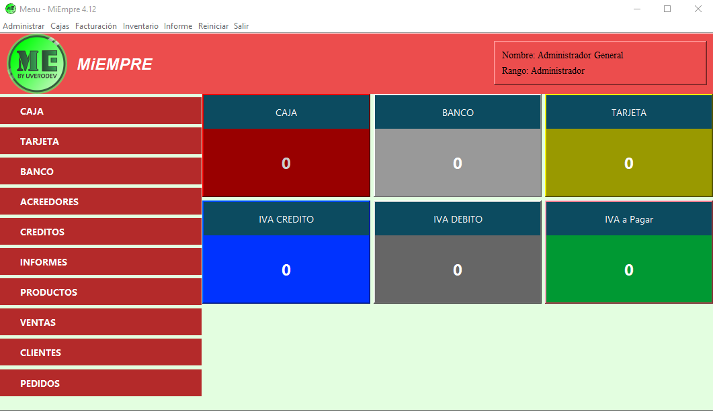
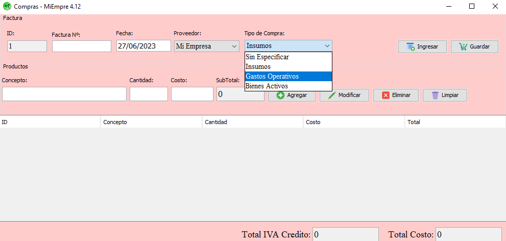
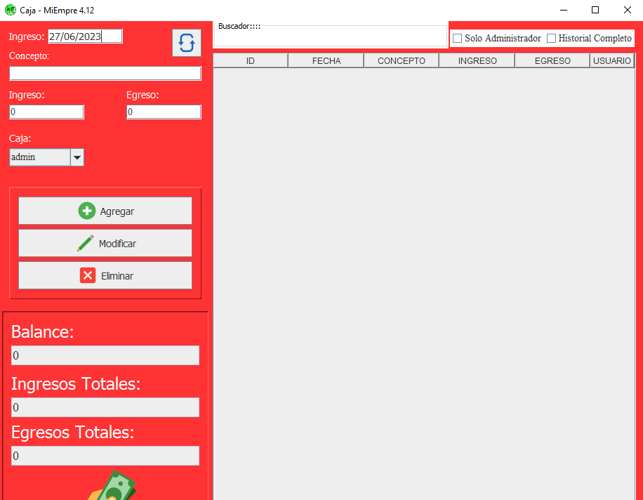

# java-sistema_ventas

Este repositorio contiene un sistema de ventas desarrollado en Java, con el objetivo de gestionar y administrar las operaciones de venta, compras y caja de un negocio. El proyecto se enfoca en brindar una solución integral para la gestión de ventas, permitiendo a los usuarios realizar diversas operaciones relacionadas con clientes, ventas, compras, caja e informes.

## Módulos

El sistema de ventas cuenta con los siguientes módulos:

### 1. Módulo de Clientes

El módulo de clientes permite gestionar la información de los clientes, incluyendo su registro, modificación y eliminación. Además, proporciona funcionalidades adicionales como búsqueda y filtrado de clientes, así como la generación de informes relacionados con el historial de clientes.

### 2. Módulo de Ventas

El módulo de ventas facilita la gestión de las operaciones de venta, tanto en modalidad de crédito como de contado. Permite registrar ventas, generar facturas, gestionar pagos y realizar consultas sobre el historial de ventas. Asimismo, se pueden generar informes detallados sobre el rendimiento de ventas y otros datos relevantes.

### 3. Módulo de Compras

El módulo de compras está diseñado para administrar las operaciones de compra de mercadería y bienes. Permite realizar el registro de compras, llevar un control de inventario, gestionar proveedores y generar informes relacionados con el movimiento de productos.

### 4. Módulo de Caja

El módulo de caja se encarga de gestionar el flujo de efectivo del negocio. Permite realizar la apertura y cierre de caja, registrar ingresos y egresos, así como generar informes relacionados con el flujo de caja y otras operaciones financieras.

### 5. Informes

El sistema de ventas también ofrece la generación de informes diversos, como el movimiento de productos, historial de clientes, historial de ventas, informes de clientes, entre otros. Estos informes proporcionan una visión detallada de los datos y permiten analizar el rendimiento del negocio.

## Tecnologías Utilizadas

El sistema de ventas está desarrollado en Java Swing 1.8 y ha sido implementado con fines académicos. Utiliza una interfaz gráfica intuitiva y amigable para facilitar su uso y comprensión.
En cuanto a la base de datos, el sistema utiliza es Posgresql.

## Contribuciones

Este repositorio es un proyecto académico y se encuentra abierto a contribuciones. Si deseas colaborar, puedes hacerlo a través de pull requests. Toda contribución es bienvenida y valorada.

## Licencia

El sistema de ventas se distribuye bajo la Licencia MIT. Puedes consultar el archivo `LICENSE` para más detalles.

